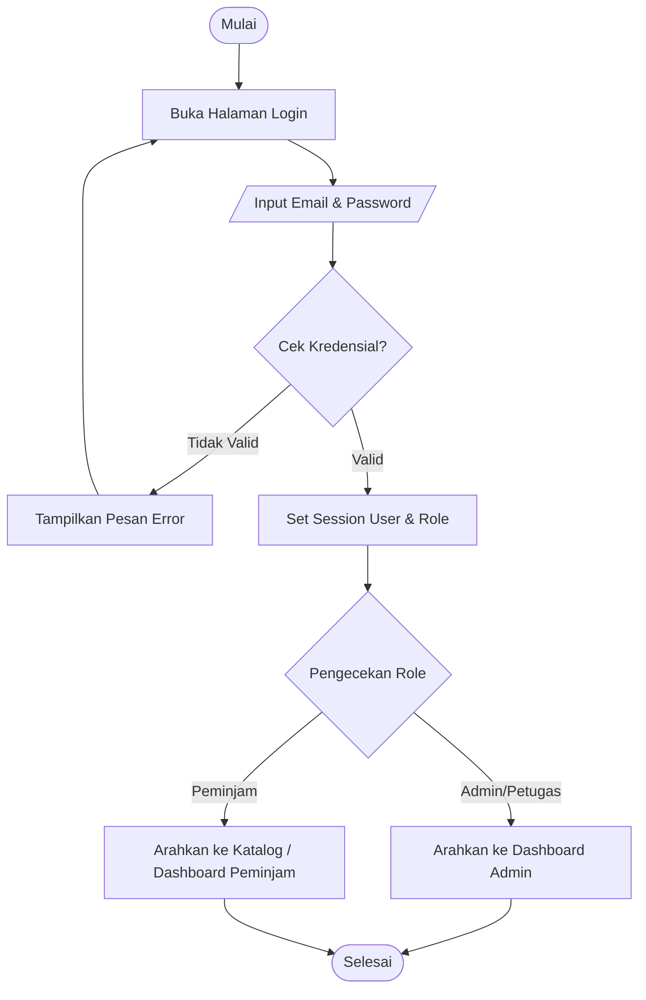

# Deskripsi Program dan Alur Kerja (Flowchart)

Dokumen ini berisi penjelasan alur kerja aplikasi Peminjaman Alat beserta flowcharts.

## 1. Proses Login



## 2. Proses Peminjaman Alat

```mermaid
flowchart TD
    A([Mulai]) --> B[Peminjam Buka Katalog Alat]
    B --> C[/Pilih Alat dan Kuantitas/]
    C --> D{Stok Tersedia?}
    D -- Tidak --> E[Tampilkan Pesan Error Stok Kurang]
    E --> C
    D -- Ya --> F[/Isi Form Tujuan & Tanggal Kembali/]
    F --> G[Simpan ke Tabel LOANS dengan Status 'pending']
    G --> H[Simpan Detail ke Tabel LOAN_ITEMS]
    H --> I(Picu Trigger: Catat ke ACTIVITY_LOGS)
    I --> J([Menunggu Persetujuan Petugas])
    
    J --> K[Petugas/Admin Mengecek Peminjaman]
    K --> L{Disetujui?}
    L -- Tolak --> M[Update Status = 'rejected']
    L -- Setuju --> N[Update Status = 'approved']
    M --> O([Selesai])
    N --> P[Peminjam Mengambil Alat]
    P --> Q[Update Status = 'borrowed']
    Q --> R[Kurangi Stok Alat (tools.stock_available)]
    R --> S([Selesai])
```

## 3. Proses Pengembalian Alat dan Denda

```mermaid
flowchart TD
    A([Mulai Pengembalian]) --> B[Petugas Buka Menu Pengembalian]
    B --> C[/Pilih Nomor Peminjaman (LOAN ID)/]
    C --> D[Panggil Stored Procedure: process_return]
    D --> E(Mulai Transaksi / START TRANSACTION)
    E --> F[Ambil return_due_date dari tabel LOANS]
    F --> G[Panggil Fungsi: calculate_fine]
    G --> H{Cek calculate_fine(expected, actual)}
    H -- <= 0 --> I[Denda = 0]
    H -- > 0 --> J[Hitung Denda = Selisih Hari * Rp 5.000]
    I --> K[Insert ke tabel RETURNS]
    J --> K
    K --> L[Update Status LOANS = 'returned']
    L --> M[Restore Stok Alat]
    M --> N(COMMIT Transaksi)
    N --> O([Selesai])
```
