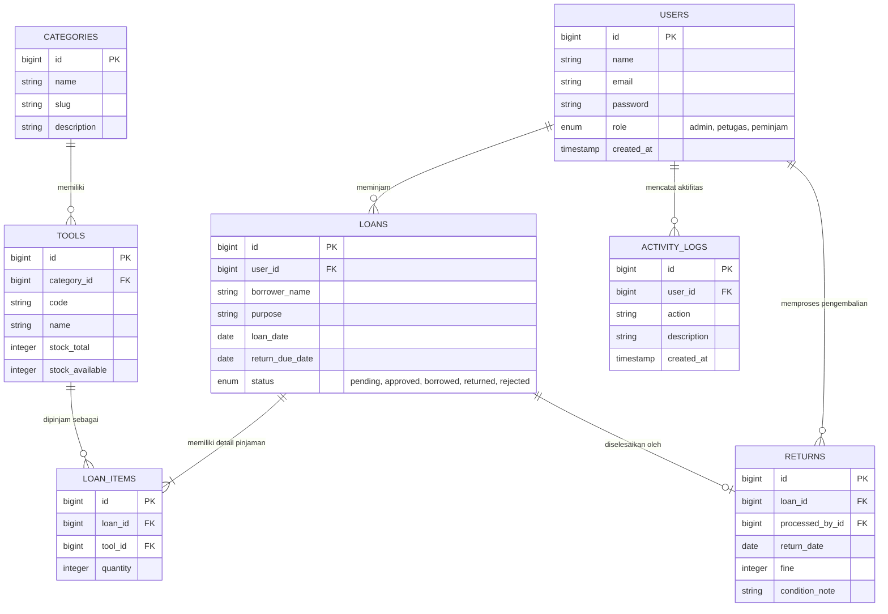

# Entity Relationship Diagram (ERD) - Peminjaman Alat

Diagram ini menggambarkan relasi antar tabel dalam basis data `peminjaman_alat`.

```mermaid
erDiagram
    USERS {
        bigint id PK
        string name
        string email
        string password
        enum role "admin, petugas, peminjam"
        timestamp created_at
    }
    
    CATEGORIES {
        bigint id PK
        string name
        string slug
        string description
    }
    
    TOOLS {
        bigint id PK
        bigint category_id FK
        string code
        string name
        integer stock_total
        integer stock_available
    }
    
    LOANS {
        bigint id PK
        bigint user_id FK
        string borrower_name
        string purpose
        date loan_date
        date return_due_date
        enum status "pending, approved, borrowed, returned, rejected"
    }

    LOAN_ITEMS {
        bigint id PK
        bigint loan_id FK
        bigint tool_id FK
        integer quantity
    }

    RETURNS {
        bigint id PK
        bigint loan_id FK
        bigint processed_by_id FK
        date return_date
        integer fine
        string condition_note
    }

    ACTIVITY_LOGS {
        bigint id PK
        bigint user_id FK
        string action
        string description
        timestamp created_at
    }

    USERS ||--o{ LOANS : "meminjam"
    USERS ||--o{ ACTIVITY_LOGS : "mencatat aktifitas"
    USERS ||--o{ RETURNS : "memproses pengembalian"
    
    CATEGORIES ||--o{ TOOLS : "memiliki"
    
    LOANS ||--|{ LOAN_ITEMS : "memiliki detail pinjaman"
    TOOLS ||--o{ LOAN_ITEMS : "dipinjam sebagai"
    
    LOANS ||--o| RETURNS : "diselesaikan oleh"
```
